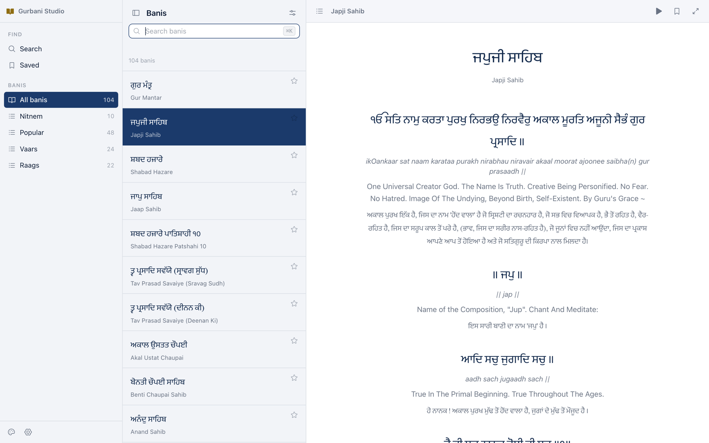
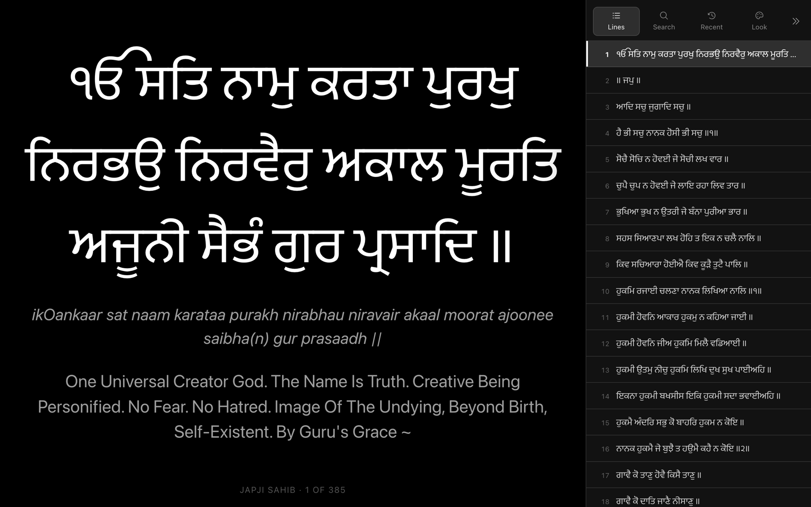

# Gurbani Studio

A desktop Gurbani reader and search workspace, built from the open data behind
[SikhiToTheMax](https://www.sikhitothemax.org).

**→ [singhgursahib0007.github.io/gurbani-studio](https://singhgursahib0007.github.io/gurbani-studio/)**

Three panes, driven from the keyboard, and it works offline. No account, no
tracking, no third-party JavaScript.

<br>

<picture>
  <source media="(prefers-color-scheme: dark)" srcset="docs/assets/studio-dark.png">
  
</picture>

## Running it

```bash
python3 -m harness fetch      # download the corpus (~25 min, resumable)
python3 -m harness build      # normalise it into one SQLite database
python3 -m harness serve      # open the app
```

Nothing beyond the Python standard library is required. The corpus is not in
this repository — at 394 MB it exceeds GitHub's file limit — but it rebuilds
exactly from the two commands above. See
[DEPLOY](docs/DEPLOY.md#where-the-corpus-lives).

## Designed for a desktop, not scaled up from a phone

**Type Gurmukhi directly.** On a physical keyboard `jkrvmm` *is* the encoding
the index is built from, so there is no on-screen keyboard in the way — you
type Latin letters and the Gurmukhi appears as you go. The on-screen keyboard
is still there as a *legend*: each key shows the Gurmukhi shape with the Latin
letter to press in its corner.

**Everything from the keyboard.** `⌘K` search · `↑↓` move · `⏎` open ·
`Space` page down · `⌘B` sidebar · `⌘\` focus mode · `⌘J` auto-scroll ·
`⌘S` save · `⌘P` command palette · `⌘,` settings · `F` immersive ·
`P` projector.

**Projector mode, for a diwan hall.** The gold button at the top of the
sidebar, or `P`, hands the screen over: one line of Gurbani as large as the
shabad allows, advanced like a slideshow with the arrow keys, space or a
presentation clicker. A glass panel on the right — the lines of what is open,
the bani catalogue, first-letter search with the Gurmukhi keyboard, the last
24 hours, and the colours — slides away with `S` when it is not wanted. `B`
rests the screen on **ਵਾਹਿਗੁਰੂ**. See **[PROJECTOR](docs/PROJECTOR.md)**.



**A reading column, not a wall of text.** A full-width line of Gurbani on a
27-inch screen is unreadable, so the column holds a measured width and centres
in the pane. Widening the window gives margins.

**Categories in the sidebar.** Nitnem, Popular, Vaars and Raags are top-level,
which leaves the middle pane free to be nothing but a list.

| | |
|---|---|
| **142,405** lines | across all seven sources |
| **820,549** translations | 11 streams: English, Punjabi, Hindi, Spanish |
| **104** banis | grouped, searchable, sortable three ways |
| **4** transliteration schemes | Roman, Devanagari, IPA, Shahmukhi |

## Documentation

Eight documents, cross-linked. There is an
**[index](docs/README.md)** that says which to read for what.

| | |
|---|---|
| **[Architecture](docs/ARCHITECTURE.md)** | how the pieces fit, and why the seams are where they are |
| **[The desktop interface](docs/DESKTOP.md)** | three panes, the keyboard, and what differs from the phone |
| **[Projector mode](docs/PROJECTOR.md)** | presenting to a hall: one line, a glass panel, a clicker |
| **[The corpus](docs/DATASET.md)** | every table and field, and where the texts come from |
| **[The harness](docs/HARNESS.md)** | the ingestion pipeline, and how to extend it |
| **[The script layer](docs/GURMUKHI.md)** | first-letter search, two encodings, and the fonts |
| **[Publishing](docs/DEPLOY.md)** | the static build, offline, where the corpus lives |
| **[Decisions and defects](docs/DECISIONS.md)** | the non-obvious calls, and the bugs found by measuring |

New here? **[ARCHITECTURE](docs/ARCHITECTURE.md)** first, then
**[DESKTOP](docs/DESKTOP.md)** if you are changing the interface or
**[DATASET](docs/DATASET.md)** if you are changing the data.

## Where the data comes from

**BaniDB**, stewarded by the [Khalis Foundation](https://khalisfoundation.org),
is the database behind SikhiToTheMax — standardised for *lagamatra* and *padh
chhedh* against the SGPC's published pothis. It publishes no SQL dump, so the
harness walks its public API exhaustively and keeps every response.
**[Shabad OS](https://shabados.com)** is downloaded whole as a cross-check.

Both are the work of volunteers. **Please treat the API gently** — the harness
rate-limits itself to well under the published limit, and its on-disk cache
means a re-run costs nothing.

## A note on the texts

This is scripture. The harness never rewrites, "corrects" or normalises the
words — every translation is stored exactly as published and attributed to the
person who made it, and upstream quirks are kept and reported rather than
quietly cleaned. The only text this project generates is the search index, and
that is [checked three independent ways](docs/GURMUKHI.md#how-the-index-is-checked).

## Related

The same corpus, designed for a phone:
[gurbani-search](https://github.com/singhgursahib0007/gurbani-search).

## Credits

Texts by the Khalis Foundation and Shabad OS, and the translators named in the
`translators` table — Prof. Sahib Singh, Manmohan Singh, Dr. Sant Singh Khalsa,
the Faridkot Teeka commentators, and the SikhNet team. Gurmukhi is set in
[Sant Lipi](https://github.com/shabados/SantLipi); icons are
[Phosphor](https://phosphoricons.com).

Built by Gursahib Singh · [gursahib99888@gmail.com](mailto:gursahib99888@gmail.com)
