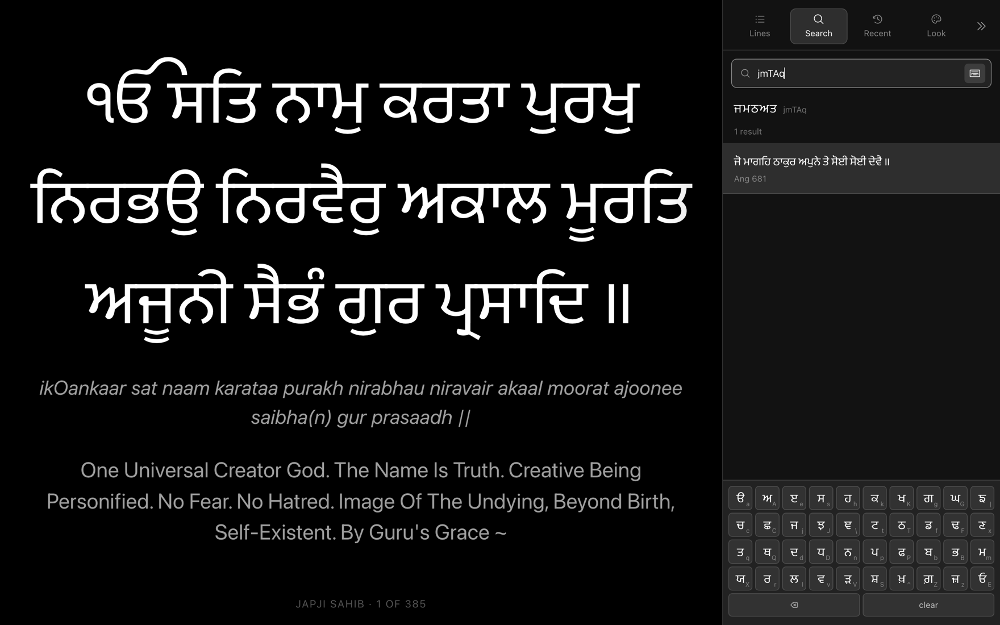

# Projector mode

For the person at the back of the diwan hall with a laptop and an HDMI cable.

Related: [DESKTOP](DESKTOP.md) for the app around it ·
[GURMUKHI](GURMUKHI.md) for what the on-screen keyboard is typing ·
[DECISIONS](DECISIONS.md) for the reasoning behind several choices here ·
[ARCHITECTURE](ARCHITECTURE.md) for where this sits in the app.

## The premise

**This screen is the screen the sangat is looking at.** There is no second
operator window and no second display assumed, because the ordinary setup is a
laptop mirrored to a projector. Everything the operator needs therefore has to
live on the same display without spoiling it.

That single constraint explains almost every decision below.

The stage takes all the width it can have; the glass panel on the right slides
away with `S`.

Enter with **`P`**, `⌘⇧P`, the projector button in the reader bar, or the
command palette. Leave with **`Esc`**.

## Keys

Bound for a presentation clicker, not for a keyboard enthusiast. A clicker
sends *one* of arrows or page up/down and you do not get to choose which, so
all of them advance.

| Key | Does |
|---|---|
| `→` `↓` `Space` `⇟` `⏎` | Next line |
| `←` `↑` `⇞` `⌫` | Previous line |
| `Home` `End` | First line, last line |
| `B` | Blank the screen |
| `S` | Show or hide the panel |
| `1` `2` `3` `4` | Lines · Search · Recent · Look |
| `/` or `⌘K` | Jump to search |
| `+` `−` | Text size |
| `L` | Larivaar |
| `F` | Browser full screen |
| `Esc` | Leave projector mode |

**`B` is not decoration.** Between shabads, during ardaas, when someone walks
in front of the beam — a presenter needs one key that makes the screen go away
without losing their place. Advancing un-blanks, so there is no way to get
stuck behind it.

## Type is fitted once per shabad, not once per line

The obvious implementation sizes each line to fill the screen. It is wrong.
Every advance would change the type size, and from the back of a hall that
reads as a fault rather than as a feature.

So the size is **the largest at which the longest line of this shabad still
fits**, and it then holds for every line of that shabad. Advancing changes the
words and nothing else.

Measuring all 385 lines of Japji Sahib on open would be wasteful, so the three
heaviest are measured and the smallest of the three answers wins. Weight is
the length of everything that will actually be drawn — Gurmukhi, and whichever
of the transliteration and translations are switched on — because that is what
drives height.

The measuring itself is a hidden twin of the slide, laid out for real at the
same width and wrapping the same way, binary-searched over eleven steps.

> **The bug this had.** The twin is absolutely positioned, and an absolutely
> positioned child resolves `left`/`right` against its container's **padding**
> box, not its content box. It measured wider than the real slide could ever
> be, approved sizes that then overflowed the bottom of the screen, and did it
> invisibly. The fix is to set its width from JS to the measured content width.

## The panel

Glass: `backdrop-filter: blur(34px) saturate(170%)` over a low-alpha fill, a
hairline border and a long shadow. It sits over the stage rather than beside
it, and the stage's right padding animates with it, so nothing is ever hidden
behind it and the text re-centres in what is left.

It has a `@supports not (backdrop-filter)` fallback to an opaque mix of the
presenter's own two colours, because without the blur a translucent panel is
just noise with Gurbani showing through it.

Drag its left edge to resize, 320–680px. The width persists.

### The four tabs

**Lines** — the default, and the reason the panel exists. Every line of what
is open, current one marked, click to jump. During kirtan the ragi jumps
about; hunting for the line by pressing `→` forty times is not a workflow.

**Search** — first-letter search with the field at the top, results under it,
and the [Gurmukhi keyboard](GURMUKHI.md#the-keyboard) at the bottom.
On by default here, unlike the desktop app, where it is off and the physical
keyboard is the input: a presenter is often clicking, not typing. Each key
shows the Gurmukhi shape with the Latin letter that types it in the corner.
Picking a result loads that shabad **at the line searched for** — not at line
one.

**Recent** — everything opened in the last 24 hours, newest first, with how
long ago. Long enough to cover a diwan and the drive home; short enough that
it stays a working set rather than an archive. Re-opening something moves it
up rather than adding a duplicate, because the same shabad comes back.

**Look** — five palettes chosen for a lamp rather than a monitor, plus a
colour picker for each of the two colours; text size; alignment; and toggles
for transliteration, English, Punjabi, larivaar and the caption.

## Colours are not the app's themes

A projector is a lamp. What reads as a rich navy on a monitor washes out on a
screen three metres wide, and white-on-black carries to the back of a hall in
a way nothing else does. So the palettes here are their own set — Black, Navy,
Ink, Paper, Sepia — and either colour can be overridden.

The furniture follows: the panel's glass, hairlines and hover states are
alphas that flip between white and black depending on whether the chosen
background is dark, computed from its **relative luminance** so it holds for
custom colours too and not only the five presets.

> **The bug this had.** `.gur` sets `color: var(--gurbani)` from the *app*
> theme. Inside projector mode that is the wrong colour by definition — near
> white Gurmukhi in the panel, on the Paper background, invisible. `.proj .gur
> { color: inherit }` hands every part of the panel back to the presenter's
> own ink.

## Preferences are its own set

`projBg`, `projInk`, `projScale`, `projTranslit`, `projEn`, `projPa`,
`projLarivaar`, `projCaption`, and the panel's own state — all separate from
the reader's.

A hall wants larger type and fewer streams under each line than a desk does.
Sharing one set of settings would mean redoing them every time the laptop is
plugged into a projector, which is the moment you have least time.

## Leaving full screen does not leave projector mode

[Immersive reading](DESKTOP.md#immersive-reading) ties the two together, and
that is right for immersive: it exists to remove the window.

Projector mode does not. A presenter may well have the browser on a second
display, sized how they want it, with no interest in the browser's own full
screen. So `fullscreenchange` is not wired to an exit here. `Esc` and the
close button are the ways out, and `F` toggles full screen on its own.

> **The bug this had.** `enter()` used to `await requestFullscreen()` before
> drawing anything. In an embedded browser view that promise never settles —
> it does not reject, it simply hangs — so the panel appeared and the stage
> stayed blank forever. Full screen is now requested and not awaited: getting
> the words up is the job, and the window chrome can catch up on its own.

## Handing back to the reader

Whatever was moved to while presenting is what the reader shows on exit. If
you searched your way to Ang 681 in front of the sangat, closing the projector
leaves you on Ang 681, not back where you started.

## Where it lives

| | |
|---|---|
| `app/js/views/projector.js` | the whole mode — stage, panel, fitting, keys |
| `app/css/projector.css` | everything scoped under `.proj` |
| `app/js/record.js` | shaping shared with the reader, and `nameLine` |
| `app/js/store.js` | `proj*` preferences, `PROJ_PRESETS`, history |

`record.js` was extracted for this. The reader and the projector show the same
thing in very different ways, and both need a record shaped the same — so the
normalising moved out of the reader rather than being copied into the
projector.

`nameLine()` lives there too: the line to name a record by is **not** line
zero, because for a shabad that is the raag-and-mahalla heading, which appears
above hundreds of shabads and so identifies none of them. Recent showed
`ਧਨਾਸਰੀ ਮਹਲਾ ੫ ॥` for its first entry until this was fixed — the same mistake,
in a new place, that [Saved had on the phone](DECISIONS.md).
